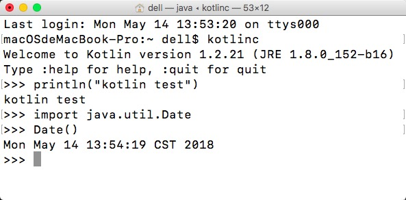
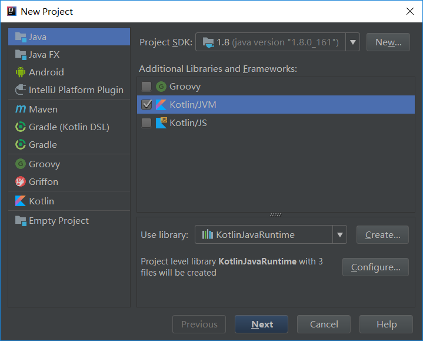

##Kotlin基础语法教程（一）

[TOC]

###Kotlin概述

Kotlin是由开发过IntelliJ IDEA、Android Studio、PyCharm等IDE的著名IDE厂商JetBrains公司设计并开源的编程语言。2011年7月推出的Kotlin项目深受《Effective Java》的影响，直到2016年2月15日第一个官方稳定版本Kotlin v1.0才正式发布，2017年Google I/O开发者大会中，Google宣布Kotlin成为Android开发的一级语言，Kotlin “转正”。

Kotlin是一种运行在JVM上的静态类型编程语言，可以编译为Java字节码，同时也可以编译成JavaScript、本地(Native)代码，方便在没有JVM的设备上运行。Kotlin语言具有以下特点：
- 与Java的编译、运行速度相似
- 比Java更安全、简洁
- 比最成熟的竞争者Scala更简洁

Kotlin在语法上具有很多下一代编程语言静态语言特性：如类型推断、函数式编程、多范式支持、可空性表达、扩展函数、模式匹配等。

Kotlin与Java具有良好的兼容性，与Java高度可互操作，在同一项目的开发中可以同时使用两种语言进行编写(仅限于不同文件中，不能在同一文件中使用两种语言)，如Kotlin可以直接调用Java的代码，而Java调用Kotlin需要使用一些注解，但也不是很复杂。IntelliJ IDEA提供了Java代码到Kotlin代码的转换功能，您只需将Java代码拷贝粘贴到.kt文件中，IDE就会自动将其转换为Kotlin代码，方便Java学习者顺利过渡到Kotlin。

Kotlin支持像Python一样的REPL环境，可以很方便的进行代码测试，对于语言的学习十分有帮助，配置环境变量后只需要在命令行输入kotlinc，即可开启REPL环境。



这篇文章面向有Java语言基础的对Kotlin有兴趣的读者，内容比较基础，主要通过两种语言的对比进行说明。

###基础语法

####Hello World



如图所示，使用IntelliJ IDEA新建项目时可选择Java，同时在右侧勾选Kotlin/JVM，或者直接新建Kotlin项目。

```
fun main(args: Array<String>) {
    println("hello world")
}
```

上述Kotlin代码的作用就是输出`hello world`，看起来比Java等语言简单得多，Kotlin中通过`fun`关键字声明一个函数，`main`是函数名，在这里是应用程序的入口；`args`是参数，这里代表命令行参数，它的类型是字符串数组，需要注意的是Kotlin的变量名通常写在类型的前面，中间用冒号分开。

`println()`是Kotlin中的顶层函数，对应Java中的`System.out.println()`函数，顶层函数不属于任何类，可以直接拿来用，类似用法的顶层函数还有`print()`等。

Kotlin的语句最后的分号不是必须的，只有当多个语句写在同一行时，才必须用分号加以区分。

####变量和数据类型

#####常量和变量

```
var a = 1
const val b = 2

fun main(args: Array<String>) {
    a = 2
    b = 1            //编译错误
    const val c = 3  //编译错误
    c = 1            //编译错误
    val d = 4
    d = 1            //编译错误
    var e: Float = 5.0f
    e = 1
}
//声明对象，对应Java中需要通过构造方法私有化实现的单例
object Test {
    const val TEST = 100
}
```

Kotlin中声明变量通常使用`val/var 变量名: 变量类型 = 表达式`，如上述代码中的变量`e`，Kotlin语言支持变量类型的自动推断，通常都不需要显式的声明变量类型。

Kotlin变量分为`var`(可变变量)和`val`(只读变量，也称不可变变量、运行期常量)，其中`var`是可写的，在它的生命周期中可以被多次赋值，如上述代码中的`a`和`e`；而`val`是只读的，它是在运行时初始化的，但仅能赋值一次，如对`d`重新赋值会发生编译错误，只读变量相当于Java中用`final`修饰的变量(并不完全相同)。只读变量的值只能被修改一次，并且不能被覆盖，这可以避免变量的值被错误的修改。

Kotlin的常量(编译期常量)用`const val`声明，仅能用于顶层常量和对象中的常量声明，如上述代码中的`b`和`Test`对象中的`TEST`常量，在函数中声明的`c`则会发生编译错误，编译期常量相当于Java中用`public final static`修饰的常量(并不完全相同)，Kotlin中的常量只能是String类型或基本数据类型。

#####基本数据类型

下表展示了Kotlin中的8种基本数据类型对应的Java基本数据类型和Java包装类：
|Kotlin基本数据类型|Java基本数据类型|Java包装类|
|:---:|:--:|:--:|
|Int|int|java.lang.Integer|
|Long|long|java.lang.Long|
|Float|float|java.lang.Float|
|Double|double|java.lang.Double|
|Short|short|java.lang.Short|
|Char|char|java.lang.Character|
|Byte|byte|java.lang.Byte|
|Boolean|boolean|java.lang.Boolean|

与Java不同，Kotlin的字符类型(`Char`)不属于数值类型，Kotlin中的基本数据类型没有对应的包装类，编译器会视具体情况将其编译为Java基本数据类型或者包装类对象。

```
    val a = 100L            //定义Long类型的变量a，L后缀(不允许使用l)表示Long类型
    val b = 123_456_789L    //通过_可以分割数字，使其更清晰
    val c = 0B10010         //0b或0B前缀表示二进制数
    val d = 0x1A            //0x或0X前缀表示十六进制数
    val pi = 3.14159        //pi默认是Double类型(不允许使用后缀d或D)，不是Float类型
    val e = 2.71828f        //f或F后缀表示Float类型
```

上述代码演示了Kotlin中数值类型的字面量，其中比较特殊的是：
- Kotlin的小数默认是`Double`类型，不能加`D`或`d`后缀
- 为了避免小写字母`l`和数字`1`的混淆，Kotlin不允许使用小写字母`l`作为Long类型整数的后缀，必须使用大写字母`L`
- 使用`_`进行比较长的数字的分割时，不强制要求每3位数字分割一次

#####非空类型与可空类型

为了避免Java中经常出现的空指针异常(`NullPointerException`)，Kotlin的类型默认定义为非空，即不可接收空值(`null`)，直接对非空类型变量赋值`null`会发生编译错误。当我们确认需要可空类型时，可以通过在非空类型后面加一问号(`?`)，此时的变量可以接收空值，如：
```
val a: Int = null       //编译错误
val b: Int? = null
```

非空类型永远不可能为null，而可空类型则存在潜在的空指针风险，Kotlin不允许可空类型对象直接调用非空类型对象的属性或函数，也不能把可空类型数据赋值给非空类型变量或是传递给非空类型参数。为了使可空类型能够调用非空类型的方法，Kotlin提供了以下几个运算符：
1. 非空断言运算符：`!!`
2. 安全调用运算符：`?.`
3. 安全转换运算符：`as?`
4. Elvis运算符(空值合并运算符): `?:`

下面对这几个运算符进行介绍：

- 非空断言运算符`!!`：非空断言运算符用于断言一个可空类型变量不为空值，使用这个运算符会存在抛出空指针异常(`kotlin.KotlinNullPointerException`)的风险。
```
fun main(args: Array<String>) {
    var a: String? = "abc"
    println(a!!.length)     //输出3
    val b: String? = null
    b!!                     //抛出空指针异常
}
```
上述代码由于对值为空的变量`b`进行了非空断言，运行时会抛出空指针异常。在最新版的Kotlin中，若已经检查了变量非空，则允许不使用非空断言运算符直接调用非空类型的属性和函数。

- 安全调用运算符`?.`：该运算符用于对可空类型变量安全的调用非空类型的属性或函数，而不会抛出空指针异常，当对象为空时，直接返回空值(`null`)，否则进行调用并返回结果。
```
fun main(args: Array<String>) {
    var a: String? = "abc"
    println(a?.length)      //输出3
    val b: String? = null
    println(b?.length)      //输出null
}
```
它等价于以下代码：
```
fun main(args: Array<String>) {
    var a: String? = "abc"
    println(a?.length)
    val b: String? = null
    if(b == null)
        println(null)
    else
        println(b!!.length)     //在最新版的Kotlin中此处的!!可以省略
}
```

- 安全转换运算符`as?`：在Kotlin中使用`as`和`as?`进行强制类型转换，这部分内容将在面向对象的多态部分进行说明。

- Elvis运算符`?:`：该运算符名称的由来是`?:`像“猫王”(美国摇滚歌手)埃尔维斯·普雷斯利(Elvis Presley)的头型和眼睛，其作用是空值合并。该运算符是一个二元运算符(注意Kotlin不存在`条件 ? 逻辑表达式1 : 逻辑表达式2`这个三元运算符)，语法是`可空类型数据 ?: 空值合并到的数据`，作用是当数据非空时，直接返回数据，而当数据为空时，返回合并到的数据。利用该运算符，可以很容易的把可空类型转换为非空类型。
```
fun main(args: Array<String>) {
    var a: String? = "abc"
    println(a?.length ?: "字符串为空")      //输出3
    val b: String? = null
    val c: Int = b?.length ?: -1
    println(c)                            //输出-1
}
```
等价于如下代码：
```
fun main(args: Array<String>) {
    var a: String? = "abc"
    println(a?.length ?: "字符串为空")
    val b: String? = null
    val c: Int
    print(c)                //编译错误，非空变量初始化前不能取值，请删掉此行代码重新运行
    if(b == null)
        c = -1
    else
        c = b!!.length      //在最新版的Kotlin中此处的!!可以省略
    println(c)
}
```

####函数声明

Kotlin既有独立于类的顶层函数，也有类方法，为了避免混淆，这里统称为函数。上述`main`中演示了参数的定义，下面的代码中演示了返回值，返回值应在函数的参数列表括号之后显式地声明。

```
fun getMax(a: Int, b: Int): Int {
    if (a > b) {
        return a
    } else {
        return b
    }
}
```

Kotlin的函数(包括顶层函数和类函数)可以带有参数默认值，而Java中想要实现类似的功能则需要冗长的方法重载或使用builder模式。

```
fun main(args: Array<String>) {
    printPerson("小明", age = 18)
}

fun printPerson(name: String, sex: Boolean = true, age: Int): Unit {
    println("姓名：" + name)
    println("性别：" + if (sex) "男" else "女")
    println("年龄：" + age)
}
```

上述代码中对参数`sex`使用了默认值`true`，在调用函数不提供参数时其值为`true`，调用时使用了命名参数`age`，采用命名参数可以增加代码的可读性，参数顺序可以与函数定义时不一致，建议带有默认值的参数放在参数列表的最后面，需要注意的是在调用函数时一旦其中一个参数采用了命名参数，其后所有的参数都必须采用命名参数形式传递。上述代码中函数的返回值类型定义为`Unit`，相当于Java中的`void`类型，此处可以省略返回值类型。

<!-- #####函数声明关键字
- 内联函数：使用`inline`关键字声明

- 尾递归：使用`tailrec`关键字声明
 -->
####字符串模板

原始字符串：使用三个双引号包起来的字符串，原始字符串中的`\`将不被识别为转义，字符串中可以包含换行，如：
```
"""hello
word"""
```
下面的代码是使用原始字符串输出三行内容，第2、3行都在行首开始，这样的代码有时看起来对齐的并不自然。
```
fun main(args: Array<String>) {
    println(getText())
}

fun getText(): String {
    return """Kotlin is created by JetBrains
Kotlin is a Programming Language running on JVM
We can use Kotlin to create Android apps"""
}
```
可以使用`trimMargin()`、`trimIndent()`裁剪函数来去除前导空格。
```
fun getText(): String {
    return """        Kotlin is created by JetBrains
        Kotlin is a Programming Language running on JVM
        We can use Kotlin to create Android apps""".trimIndent()
}
```
String类型的函数(方法)`trimIndent()`用于切割每一行开头相同数量的空格。
```
fun getText(): String {
    return """Kotlin is created by JetBrains
        #Kotlin is a Programming language running on JVM
        #We can use Kotlin to create Android apps""".trimMargin("#")
}
```
`trimMargin()`函数用于从字符串中每行的开头裁剪指定的字符串参数以及前面的全部空格，如果不提供参数，则以`|`作为参数默认值。

Kotlin还支持类似于PHP中的字符串模板，利用这一特性，前面提供的函数可以进行如下改写：
```
fun printPerson(name: String, sex: Boolean = true, age: Int): Unit {
    println("姓名：$name")
    println("性别：${if (sex) "男" else "女"}")
    println("年龄：$age")
}
```
在原始字符串和一般的字符串中都允许使用字符串模板，字符串模板能够简化字符串拼接的操作，字符串模板是以`$`开头，其语法为`$变量或常量名`或`${表达式}`，如果想要在字符串中使用`$`符号，请用`${'$'}`或`\$`代替。

####流程控制

#####if语句/表达式

Kotlin简化了Java中的一些语句，将其变为具有返回值的表达式，主要有`if`表达式、`when`表达式、`try`表达式、表达式函数体，示例代码如下：

```
fun main(args: Array<String>) {
    var a = 1
    var b = 2
    //if表达式，可以自动推断出max的类型是Int，不需要显式声明
    val max = if(a > b) a else b
    //对可变变量重新赋值
    a = 5
    b = 3
    //调用下面定义的getMin函数
    val min = getMin(a, b)
}
//表达式函数体，返回值是执行到的语句块的最后一条语句
fun getMin(a: Int, b: Int) = if(a > b) {
    println("b < a")
    b       //if表达式的返回值
} else {
    println("a < b")
    a       //if表达式的返回值
}
```

#####when语句/表达式

Kotlin放弃了C和Java中的`switch`语句，采用一个新的`when`语句/表达式，相比`switch`语句，`when`语句/表达式要更加的强大、灵活。

`when`是一个多分支的结构，像`if`一样，`when`的每一个分支都可以是一个代码块，`when`表达式也具有返回值，它的值是块中最后的表达式的值。可以用任意表达式(不只是常量)作为分支条件，也可以把多个分支条件通过逗号放在一起，还可以用`in`和`!in`加上一个区间检测一个值是否在一个区间或者集合中、用`is`和`!is`加上一个类名判断是否是某个类的实例(Java中对应的是`instanceof`)，如果所有分支都不满足，则会执行`else`分支(可以没有)。

```
fun main(args: Array<String>) {

    val score = 98
    val result = when (score) {
        97, 98, 99 -> "接近满分了"
        in 90..96, 100 -> {
            println("优")
            "优秀"
        }
        in 60..89 -> "及格"
        in 0..59 -> "不及格"
        else -> {
            println("成绩输入不正确")
            null
        }
    }
}
```

上述代码中的`..`是区间运算符，如`0..59`是生成闭区间[0, 59]内的整数数列，每个区间是一个可迭代的对象，Kotlin还提供了一个半开区间运算符`until`，如`0 until 10`则是生成半开区间[0,10)内的整数，Kotlin核心库中共提供了3个闭区间类：`IntRange`、`LongRange`和`CharRange`。

#####循环语句

Kotlin具有和C、Java类似的`do-while`循环和`while`循环，这里不再赘述，主要介绍`for`循环。下面演示一个打印乘法口诀表的代码：
```
fun main(args: Array<String>) {
    for(i in 1..9) {
        for(j in 1..i)
            print("$j×$i=${i * j}\t")
        println()           //另起一行
    }
}
```
Kotlin的`for`循环相当于Java的`foreach`循环，但`for`循环中的变量无需用`var`或`val`声明，`for-in`循环可用于对范围或者集合进行遍历。结合生成递减数列的中缀运算符，可以实现更复杂的功能。

```
fun main(args: Array<String>) {
    for(i in 15 downTo 1 step 3)
        println(i)
}
```

上述代码中的`downTo`是生成一个递减数列，而`step`则是设置数列的步长。

#####带标签的break和continue

与Java类似，Kotlin也支持带标签的break和continue语句，语法是在`for`、`while`或`do`前面加上`标签名@`，使用标签时用`break/continue@标签名`，如：
```
fun main(args: Array<String>) {
    label1@ for (x in 0..10) {
        for (y in 10 downTo 5 step 3) {
            if(x % 2 == 0) continue@label1
            if(y == x) break@label1
            println("(x, y)=($x, $y)")
        }
    }
}
```

####Kotlin运算符

#####算术运算符、逻辑运算符和关系运算符

Kotlin的算术运算符、逻辑运算符与Java一致，关系运算符与Java稍有不同，其中`==`运算符对两个对象进行比较，调用的是对象的`equals()`函数，`!=`则是对`==`运算符的取反；而对引用类型的比较则需使用`===`和`!==`运算符，用于判断两个引用是否指向同一个对象。当一个对象与`null`进行显式的比较时，使用两种运算符效果相同，Kotlin会自动将`==`转换为`===`。

#####位运算符

Java和Kotlin的位运算符和Kotlin位运算符的示例如下表所示：
|名称|Java位运算符|Kotlin位运算符|示例|
|:--|:--|:--|:--|
|位取反|~|inv|a.inv()|
|位与|&|and|a and b 或 a.and(b)|
|位或|&#124;|or|a or b 或 a.or(b)|
|位异或|^|xor|a xor b 或 a.xor(b)|
|左移|<<|shl|a shl b 或 a.shl(b)|
|有符号右移|>>|shr|a shr b 或 a.shr(b)|
|无符号右移|>>>|ushr|a ushr b 或 a.ushr(b)|

#####其他运算符

前面的介绍中提到了非空断言运算符`!!`、安全调用运算符`?.`、安全转换运算符`as?`、Elvis运算符`?:`等，Kotlin的y一些运算符是通过调用转换方法来实现的，下表介绍了一些运算符及其转换方法：

- 一元运算符

|名称|运算符|转换方法|作用|
|:--|:--|:--|:--|
||+a|a.unaryPlus()||
||-a|a.unaryMinus()||
||!a|a.not()||
|自增|a++或++a|a.inc()||
|自减|a--或--a|a.dec()||
|引用|::||引用类、属性或函数|
|展开|*||用于将数组传递给可变参数|

- 二元运算符

|名称|运算符|转换方法|作用|
|:--|:--|:--|:--|
|相加|a + b|a.plus(b)||
|相减|a - b|a.minus(b)||
|相乘|a * b|a.times(b)||
|相除|a / b|a.div(b)||
|取余|a % b|a.mod(b)||
|区间|a..b|a.rangeTo(b)||
|比较|>、<、>=、<=|a.compareTo(b)|比较两个对象，通过返回值的正负判断大小|
||a in b|b.contains(a)|判断a是否在b中|
||a !in b|!b.contains(a)||
|相等|a == b|a?.equals(b) ?: (b === null)||
|不等|a != b|!(a?.equals(b) ?: (b === null))||
|调用|a(i)|a.invoke(i)||
|调用|a(i, j)|a.invoke(i, j)||
|调用|a(i_1, … , i_n)|a.invoke(i_1, …, i_n)||
|索引访问|a[i]|a.get(i)||
|索引访问|a[i, j]|a.get(i, j)||
|索引访问|a[i_1, …, i_n]|a.get(i_1, …, i_n)||
|索引访问|a[i] = b|a.set(i, b)||
|索引访问|a[i, j] = b|a.set(i, j, b)||
|索引访问|a[i_1, …, i_n] = b|a.set(i_1, …, i_n, b)||


####局部函数和匿名函数

Kotlin的函数可以声明在类内部，称为成员函数，还可以声明在另一函数的内部，称为局部函数。当函数只被调用一次时，可以声明为匿名函数。

```
fun main(args: Array<String>) {
    println(calculate(1.0, 2.0))
    println(calculate(1.0, 2.0, '-'))
    println(calculate(1.0, 2.0,'*'))
    println(calculate(1.0, 2.0, '/'))
    println(calculate(2.0, 1.0, '%'))
}

fun calculate(n1: Double, n2: Double, operator: Char = '+'): Double {
    //resultFun是一个函数类型的变量，
    val resultFun: (Double, Double) -> Double = when (operator) {
        '+' -> fun(a: Double, b: Double): Double { return a + b }
        '-' -> fun(a, b) = a - b
        '*' -> { a: Double, b: Double -> a * b }
        '/' -> { a, b -> a / b }
        else -> { _, _ ->
            println("输入数据错误")
            0.0
        }
    }
    return resultFun(n1, n2)
}
```

上述代码中使用了`when`表达式、参数默认值和命名参数、函数类型变量、匿名局部函数、表达式函数体、Lambda表达式和类型推断。

Kotlin支持函数类型，可以定义函数类型的变量，类似C语言中的函数指针，允许把函数作为参数传递，这是Kotlin对Java反射机制的增强实现，反射机制内容较多，这里只对函数类型进行说明：函数类型的格式为:`(参数数据类型列表) -> 返回值类型`，例如：`() -> Unit`表示空参数列表无返回值的函数类型，`(Double, Double) -> Double`表示两个浮点型参数，返回值为浮点型的函数类型。

上述代码五个分支全部使用了匿名局部函数，其中`"+"`分支是省略了函数名(匿名)的局部函数，`"-"`分支进一步将使用表达式函数体简化了函数体并省略参数和返回值类型的声明(Kotlin会根据定义的接收函数的变量的类型进行推断)，`"*"`、`"/"`和`else`分支使用了Lambda表达式。

Lambda表达式是一种特殊的匿名函数，它是一个函数对象，其声明方式为{ 参数列表 ->  语句块 }，Lambda表达式内部的返回值是语句块的最后一行，Lambda表达式的参数列表类型也支持自动推断，当某个参数在语句块中没有用到的时候，可以通过下划线`_`占位，如`else`分支，当Lambda只有一个参数时，可以省略参数，只写语句块，其中唯一的参数(隐式参数)用`it`标识符代替。

Kotlin约定，在调用函数时，如果使用Lambda表达式作为参数，若Lambda表达式是最后一个参数，可以将Lambda表达式块移到参数列表括号的后面，而当只有这一个参数时，前面的小括号可以省略，如：
```
fun main(args: Array<String>) {
    ButtonClick({ x:Int, y:Int -> x + y })
    ButtonClick() { x, y -> x - y }
    ButtonClick { a, b -> a * b }
}

fun ButtonClick(block: (a: Int, b: Int) -> Int) {
    println(block(1, 2))
}
```

####数组

#####基本数据类型数组

Kotlin基本数据类型数组和Java基本数据类型数组的对应关系如下表所示：
|Kotlin基本数据类型数组|Java基本数据类型数组|
|:--:|:--:|
|IntArray|int[]|
|LongArray|long[]|
|FloatArray|float[]|
|DoubleArray|double[]|
|ShortArray|short[]|
|ByteArray|byte[]|
|CharArray|char[]|
|BooleanArray|boolean[]|

Kotlin的数组都是通过使用顶层函数创建的，基本数据类型数组有3种创建方式，以`Int`类型为例，它们的函数声明如下：
1. `intArrayOf(varag element: Int)`：这里的`varag`表示这是一个可变参数，可变参数必须位于参数列表的最后一个，调用时需要提供零个或多个`Int`类型的数据
2. `IntArray(size: Int)`：该函数通过指定数组的元素个数创建数据类型默认值的数组，`Int`的默认值是0
3. `IntArray(size: Int, init: (Int) -> Int)`：该函数第一个参数指定数组大小，第二个参数提供一个`(Int) -> Int`类型的函数，通常使用Lambda表达式，函数的第一个参数是数组的下标(从0开始)

```
    val a = intArrayOf(1, 0, 0, 8, 6)               //产生由1, 0, 0, 8, 6构成的基本数据类型数组
    val b = intArrayOf(*a, 1, 1)                    //*是展开运算符，产生由1, 0, 0, 8, 6, 1, 1构成的基本数据类型数组
    val c = DoubleArray(8)                          //产生8个0.0构成的基本数据类型数组
    val d = CharArray(26) { (it + 65).toChar() }    //产生26个大写字母构成的基本数据类型数组
    d[0] = 'a'                                      //通过调用set()函数为数组单个成员赋值
```

#####对象数组
Kotlin中的对象数组对应Java中的包装类数组，其对应关系为：
|Kotlin对象数组|Java包装类数组|
|:--:|:--:|
|Array<Int\>|java.lang.Integer[]|
|Array<Long\>|java.lang.Long[]|
|Array<Float\>|java.lang.Float[]|
|Array<Double\>|java.lang.Double[]|
|Array<Short\>|java.lang.Short[]|
|Array<Byte\>|java.lang.Byte[]|
|Array<Char\>|java.lang.Character[]|
|Array<Boolean\>|java.lang.Boolean[]|

对象数组也有3种创建方式，以`Int`类型为例：
1. `arrayOf(varag elements: T)`：创建类型为`T`的数组变量，提供一组相同数据类型的数据列表
2. `arrayOfNulls<T>(size: Int)`：`size`参数用于指定创建数组的大小，该函数用于创建一个类型为T的数组，所有的元素均为空值
3. `Array(size:Int, init: (Int) -> T)`：该函数第一个参数指定数组大小，第二个参数提供一个`(Int) -> T`类型的函数，通常使用Lambda表达式，函数的第一个参数是数组的下标(从0开始)

```
fun main(args: Array<String>) {
    val array2D = Array(3) { arrayOfNulls<Int>(5) }
    println(array2D.indices)            //数组的indices属性是数组的下标区间
    println(array2D[0].indices)
    //遍历方式1
    for(i in array2D)
        for(j in i)
            println(j)
    //遍历方式2
    for(i in array2D.indices)
        for(j in array2D[0].indices)
            println(array2D[i][j])
}
```

需要本教程MarkDown版本的请联系QQ：2336233438